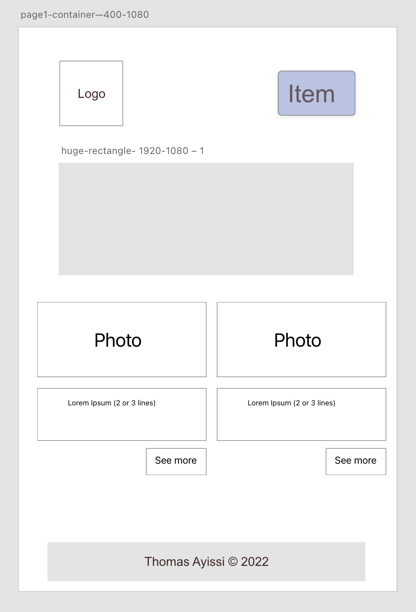
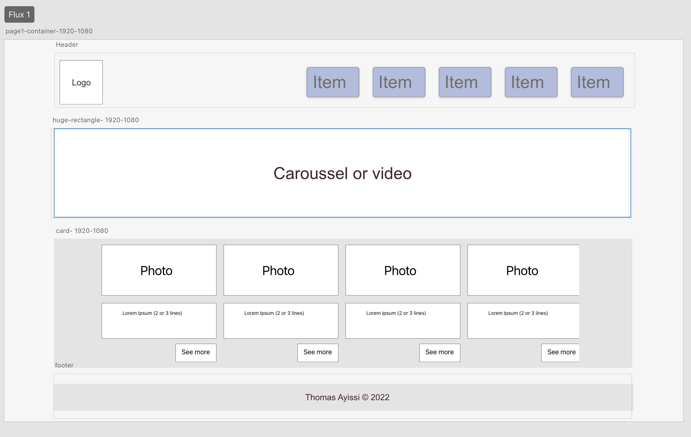

# Project name

> Thomas WebSite

## Table of contents

- Project name
- General info
- Screenshots
- Technologies
- Configuration
- Code examples
- Features
- Status
- Inspiration
- Contact
- Instructions for use
- Code quality checks
- Continuous integration
- Repository setup

### Name of our project

> Thomas WebSite

### General info

1. Home page
2. Skills page
3. Cheat Sheet page

### Screenshots




### Technologies

1. HTML
2. CSS
3. Grid
4. Flexbox
5. Node 14.16.0
6. JavaScript
7. VSC code

### Configuration (set up)

#### Installation

- `npm run start`
- `npm run build`

#### A guide to using source repository

1. `git clone git@github.com:HackYourFutureBelgium/template-markdown.git`
2. `cd template-markdown`
3. `npm install`

#### Code quality checks

- `npm run format`: Make sure all the code in this repository is formatted
  correctly (looks good). (looks good).
- `npm run lint:ls`: Checks that all the folder and file names match the
  conventions of the repository.
- `npm run lint:md`: Checks all Markdown files in this repository.
- `npm run lint:css`: Will make a copy of all CSS files in this repository.
- `npm run validate:html`: Validates all HTML files in your project.
- `npm run spell-check`: Goes through all the files in this repository looking
  for words it doesn't recognize. Just because it says something is an error
  does not mean it is! It doesn't know every word in the world. You can add new
  correct words to the [./.cspell.json](../.cspell.json) file so that they do
  not cause an error. an error.
- `npm run accessibility -- ./path/to/file.html`: Runs an accessibility scan on
  all HTML on all HTML files in the given path and writes the report to the file
  `/accessibility_report` file.

#### Continuous Integration (CI)

When you open a PR to `main`/`master` in your repository, GitHub will
automatically do a linting check on the code in that repository, you can see
this in the this in the file
[github/workflows/lint.yml](https://github/workflows/lint.yml).

If the linting fails, you will not be able to merge the PR. You can check that
your code will that your code will pass before pushing it by running the code
quality scripts locally.

#### Repo configuration

- Give each member _written_ access to the repo (if it's a group project).
- Enable GitHub pages and put a link to your website in the repo description.
- Activate the GitHub Actions
- in the _Branches_ section of your repo settings, make sure :
  - The repository
    [requires review](https://github.blog/2018-03-23-require-multiple-reviewers/)
    before pull requests can be merged.
  - The `master`/`main` branch must "_Require status checks to pass before
    merge_"
  - The `master`/`main` branch must "_Require required branches to be up to date
    before merging_"

## Code examples

```HTML
//
<!-- NAVBAR -->
          <div class="navbar">
              <div class="container flex">
                  <h1 class="logo">Thomas WebSite</h1>
                      <nav>
                           <ul>
                               <li><a href="../index.html">Home</a></li>
                               <li><a href="../pages/skills.html">Skills</a></li>
                               <li><a href="../pages/cheatsheet.html">Cheatsheet</a></li>
                           </ul>
                      </nav>
              </div>
          </div>
```

## Features

### List of ready features and Todos for future development

-
-
-

### List of things to do

-
-

## Status

The project is: in progress

## Inspiration

[HYF Template for HTML and CSS](https://github.com/HackYourFutureBelgium/template-html-css)

## Contact

[Thomas GitHub Page](https://github.com/thomas-ayissi/thomas-ayissi.github.io.git)

## Group Members

| Name               | GitHub Links                                      |
| ------------------ | ------------------------------------------------- |
| **Verousca Ekema** | [Verousca](https://github.com/Verousca)           |
| **Thomas Ayissi**  | [thomas-ayissi](https://github.com/thomas-ayissi) |

## How to use
